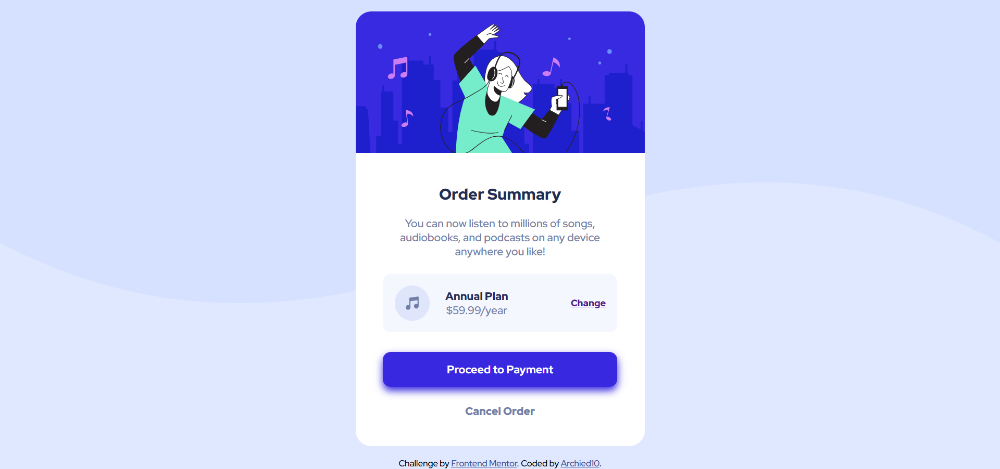

# Frontend Mentor - Order summary card solution

This is a solution to the [Order summary card challenge on Frontend Mentor](https://www.frontendmentor.io/challenges/order-summary-component-QlPmajDUj). Frontend Mentor challenges help you improve your coding skills by building realistic projects. 

## Table of contents

- [Overview](#overview)
  - [Screenshot](#screenshot)
  - [Links](#links)
- [My process](#my-process)
  - [Built with](#built-with)
  - [What I learned](#what-i-learned)
  - [Continued development](#continued-development)
  - [Useful resources](#useful-resources)
- [Author](#author)

## Overview

### Screenshot

### Links

- Solution URL: [Solution](https://github.com/Archied10/order-summary-component-main)
- Live Site URL: [Live Site](https://archied10.github.io/order-summary-component-main/)

## My process

### Built with

- Semantic HTML5 markup
- CSS custom properties

### What I learned

The most difficult part of creating a website is to get the right size, padding, and margin of components.
I found out that I can set specific designs for specific properties.

### Continued development

I want to focus to learn more of css properties to create websites to perfection.

### Useful resources

- [W3Schools](https://www.w3schools.com) - This website helped me to study html and css.
- [Stack Overflow](https://stackoverflow.com/) - This website helped me when I'm stuck.
- [CSS Generator](https://cssgenerator.org/box-shadow-css-generator.html) - This website helped me to generate box shadow.

## Author

- Website - [Archied10](https://github.com/Archied10)
- Frontend Mentor - [@Archied10](https://www.frontendmentor.io/profile/Archied10)